### Hi there 👋

  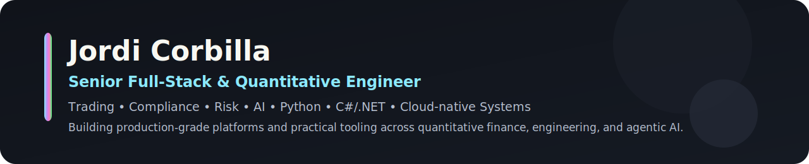

I’m a **Senior Full-Stack & Quantitative Engineer** building **trading, compliance, risk, and AI systems**.

With over two decades of experience designing and delivering end-to-end software, I specialize in building systems that need to be **fast, reliable, scalable, and production-ready**. Originally from Spain and now based in the UK, I currently work in the **Trading Execution & Compliance Technology** team at a top-tier global multi-strategy hedge fund, where I help architect and implement mission-critical platforms supporting complex, high-volume trading environments.

My work sits at the intersection of **Python**, **C#/.NET**, **cloud-native engineering**, **portfolio analytics**, and **agentic tooling**. I’m particularly interested in systems where strong engineering discipline, quantitative thinking, and practical automation come together to solve difficult real-world problems.

My academic background includes a Master’s in [Computer Engineering](https://estudios.uoc.edu/es/masters-universitarios/ingenieria-informatica/presentacion), a Bachelor’s in [Computer Engineering](https://estudios.uoc.edu/es/grados/ingenieria-informatica/presentacion) from the Open University of Catalonia, and a Bachelor’s in Industrial [Electronics Engineering](https://www.udg.edu/en/estudia/Oferta-formativa/Graus/Fitxes?IDE=1263&ID=3105G0309) from the University of Girona. I have also completed advanced specializations in [IBM RAG and Agentic AI](https://www.coursera.org/account/accomplishments/specialization/JTBAJ6893W87), [IBM Data Science](https://www.coursera.org/account/accomplishments/specialization/NES8YHEFVY62), [Investment Management with Python and Machine Learning](https://coursera.org/share/d6e18431afa1b92cb83c5fdc9f2f57f1), [Financial Engineering and Risk Management](https://www.coursera.org/account/accomplishments/specialization/RYBNP2KXDCWB), and [Machine Learning Specialization](https://www.coursera.org/account/accomplishments/specialization/YX4P4JSVMYXF).

I use this space to share projects across **quantitative finance**, **AI**, **developer tooling**, and **applied machine learning**. If you only look at one project, start with **[RiskOptima](https://github.com/JordiCorbilla/RiskOptima)**.

I also write about engineering, AI tooling, and software design on my blog, ["Random Thoughts on Coding & Technology"](https://thundaxsoftware.blogspot.com/).

Feel free to connect with me on [LinkedIn](https://www.linkedin.com/in/jordicollcorbilla/) or follow me on [X](https://x.com/thunderjordi).

### Flagship Projects

  <a href="https://github.com/JordiCorbilla/RiskOptima" target="_blank">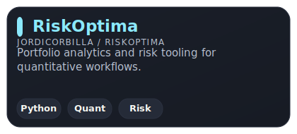</a>
  <a href="https://github.com/JordiCorbilla/table.lib" target="_blank">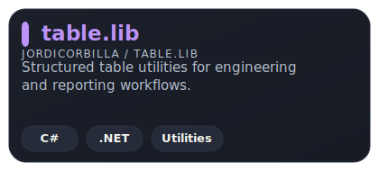</a>

  <a href="https://github.com/JordiCorbilla/stock-prediction-deep-neural-learning" target="_blank">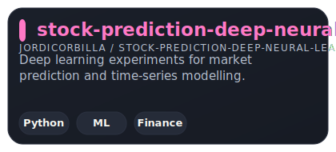</a>
  <a href="https://github.com/JordiCorbilla/langgraph-cookbook" target="_blank">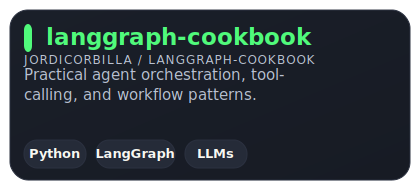</a>

### Recent Repositories

  <a href="https://github.com/JordiCorbilla/local-voice-studio" target="_blank">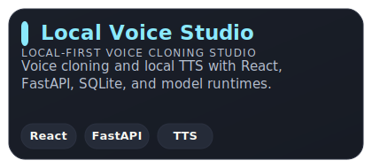</a>
  <a href="https://github.com/JordiCorbilla/codex-engineering-playbook" target="_blank">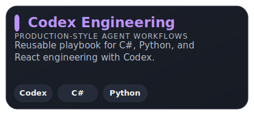</a>

  <a href="https://github.com/JordiCorbilla/engineering-skills-for-codex" target="_blank">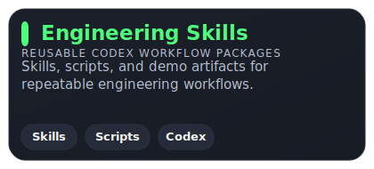</a>
  <a href="https://github.com/JordiCorbilla/fund-overlap-lab" target="_blank">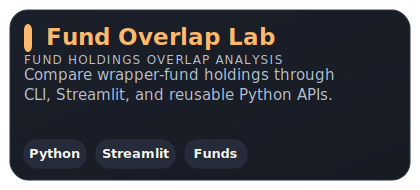</a>

  <a href="https://github.com/JordiCorbilla/Quantitative-Developer-Reference-Library" target="_blank">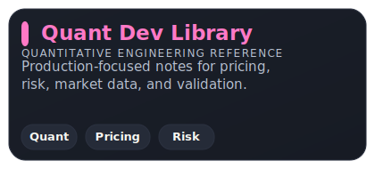</a>

### Quant Finance, AI & Engineering Portfolio

  <a href="https://github.com/JordiCorbilla/efficient-frontier-monte-carlo-portfolio-optimization" target="_blank">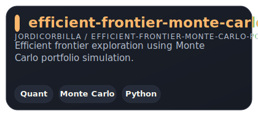</a>
  <a href="https://github.com/JordiCorbilla/index-vol-divergence-signals" target="_blank">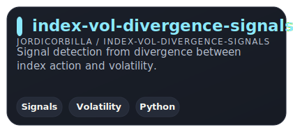</a>

  <a href="https://github.com/JordiCorbilla/portfolio-optimization-probability-analysis" target="_blank">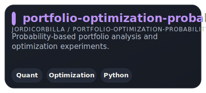</a>
  <a href="https://github.com/JordiCorbilla/QuantitativeFinance" target="_blank">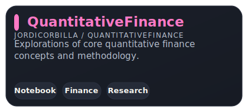</a>

  <a href="https://github.com/JordiCorbilla/RAG-PDF-Chatbot" target="_blank">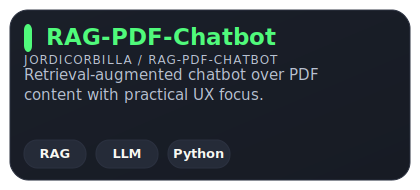</a>
  <a href="https://github.com/JordiCorbilla/AI-Tutor" target="_blank">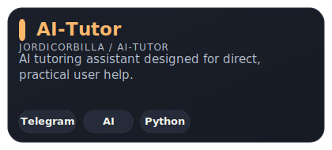</a>

