# Hi there 👋

  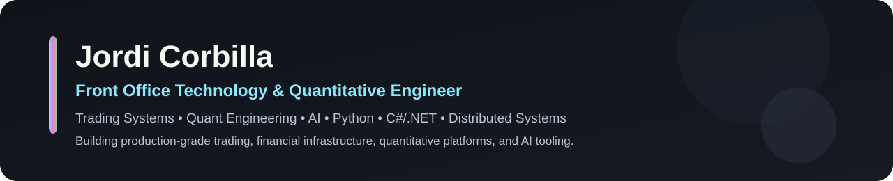

I’m a **Senior Full-Stack & Quantitative Engineer** building **trading, compliance, risk, and AI systems**.

With over two decades of experience designing and delivering end-to-end software, I specialize in systems that need to be **fast, reliable, scalable, and production-ready**. My focus is the architecture and implementation of mission-critical platforms for complex, high-volume financial environments.

My work sits at the intersection of **Python**, **C#/.NET**, **cloud-native engineering**, **portfolio analytics**, and **agentic tooling**. I’m particularly interested in systems where strong engineering discipline, quantitative thinking, and practical automation come together to solve difficult real-world problems.

My academic background includes a [Master’s in Computer Engineering](https://estudios.uoc.edu/es/masters-universitarios/ingenieria-informatica/presentacion) and a [Bachelor’s in Computer Engineering](https://estudios.uoc.edu/es/grados/ingenieria-informatica/presentacion), both from the Open University of Catalonia, as well as a [Bachelor’s in Industrial Electronics Engineering](https://www.udg.edu/en/estudia/Oferta-formativa/Graus/Fitxes?IDE=1263&ID=3105G0309) from the University of Girona.

I have also completed advanced specializations in [IBM RAG and Agentic AI](https://www.coursera.org/account/accomplishments/specialization/JTBAJ6893W87), [IBM Data Science](https://www.coursera.org/account/accomplishments/specialization/NES8YHEFVY62), [Investment Management with Python and Machine Learning](https://coursera.org/share/d6e18431afa1b92cb83c5fdc9f2f57f1), [Financial Engineering and Risk Management](https://www.coursera.org/account/accomplishments/specialization/RYBNP2KXDCWB), and [Machine Learning](https://www.coursera.org/account/accomplishments/specialization/YX4P4JSVMYXF).

I use this space to share projects across **quantitative finance**, **AI**, **developer tooling**, and **applied machine learning**. If you only look at one project, start with **[RiskOptima](https://github.com/JordiCorbilla/RiskOptima)**.

## Flagship Projects

The projects that best represent how I combine quantitative thinking with production engineering.

  <a href="https://github.com/JordiCorbilla/RiskOptima">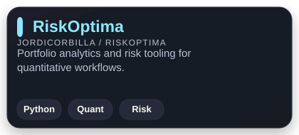</a>
  <a href="https://github.com/JordiCorbilla/table.lib">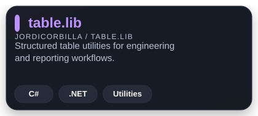</a>

  <a href="https://github.com/JordiCorbilla/stock-prediction-deep-neural-learning">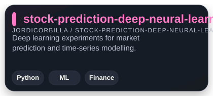</a>
  <a href="https://github.com/JordiCorbilla/langgraph-cookbook">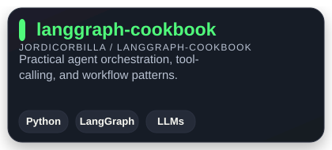</a>

## Recent Work

A rolling selection of newer work across quantitative platforms, language models, trading infrastructure, and production engineering.

  <a href="https://github.com/JordiCorbilla/RiskOptima-Platform">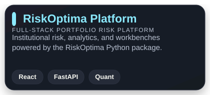</a>
  <a href="https://github.com/JordiCorbilla/llm-from-scratch">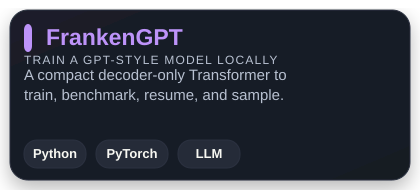</a>

  <a href="https://github.com/JordiCorbilla/Quantitative-Developer-Reference-Library">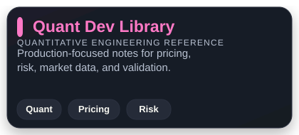</a>
  <a href="https://github.com/JordiCorbilla/fix-protocol-knowledge-base">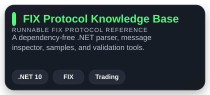</a>

  <a href="https://github.com/JordiCorbilla/react-forge-kit">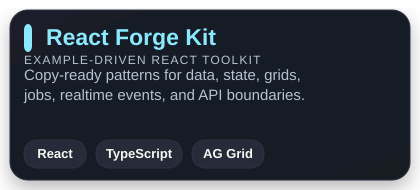</a>
  <a href="https://github.com/JordiCorbilla/dotnet-low-latency-playbook">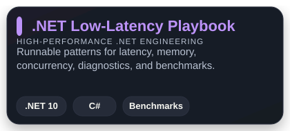</a>

## More Quant Finance, AI & Engineering

  <a href="https://github.com/JordiCorbilla/efficient-frontier-monte-carlo-portfolio-optimization">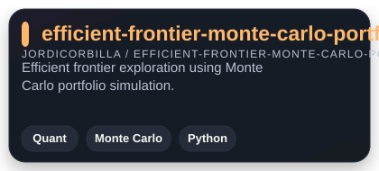</a>
  <a href="https://github.com/JordiCorbilla/index-vol-divergence-signals">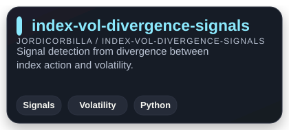</a>

  <a href="https://github.com/JordiCorbilla/portfolio-optimization-probability-analysis">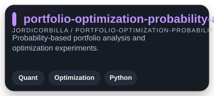</a>
  <a href="https://github.com/JordiCorbilla/QuantitativeFinance">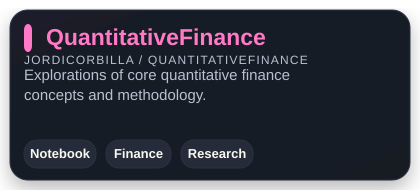</a>

  <a href="https://github.com/JordiCorbilla/RAG-PDF-Chatbot">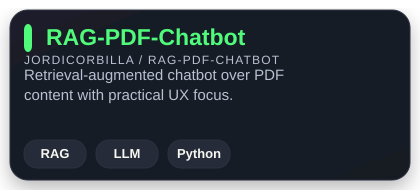</a>
  <a href="https://github.com/JordiCorbilla/AI-Tutor">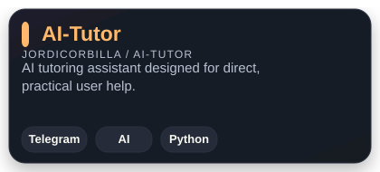</a>

  <a href="https://github.com/JordiCorbilla?tab=repositories"><strong>Explore all repositories →</strong></a>

